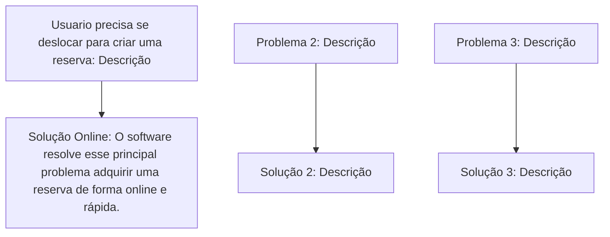

**Sistema de reserva e Salas e Equipamentos**

_*Quais problemas estamos querendo resolver?*_

***
_*Qual o **objetivo** do software*_? 

***
_*Quais os tipos de ***usuarios*** que vão usar o software e o que cada tipo de usuario vai poder fazer?*_

***

_*Escopo Inicial*_

***

_*Regras de negócios*_

***

_*Requisitos Funcionais*_

***

_*Requisitos não funcionais*_

***

_*Relação entre regras de negócios e requisitos*_

***

_*Documentação*_ 

***
***Conclusão Final*** 